🔝 Retour au [Sommaire](/SOMMAIRE.md)

# 13.3 Cluster Autoscaler (pour multi-node)

## Qu'est-ce que le Cluster Autoscaler ?

Le Cluster Autoscaler (CA) est un composant qui ajuste automatiquement la taille de votre cluster Kubernetes en ajoutant ou retirant des nodes (machines) selon les besoins. Si HPA ajoute des pods et VPA les redimensionne, Cluster Autoscaler ajoute des machines entières au cluster. C'est comme gérer une flotte de taxis : quand il y a trop de clients (pods) pour les taxis disponibles (nodes), vous appelez plus de taxis ; quand la demande baisse, vous renvoyez les taxis excédentaires.

Dans un contexte MicroK8s de lab, même si vous n'avez pas accès à une infrastructure cloud élastique, comprendre et expérimenter avec Cluster Autoscaler sur plusieurs machines physiques ou VMs vous prépare aux environnements de production et vous permet de simuler des scénarios réalistes.

## Pourquoi le Cluster Autoscaler dans un Lab

### Scénarios d'Usage en Lab

Bien que votre lab n'ait pas l'élasticité infinie du cloud, plusieurs scénarios justifient l'utilisation du Cluster Autoscaler :

**Simulation d'environnements cloud** : Testez le comportement de vos applications dans un environnement qui scale automatiquement, même à petite échelle.

**Gestion de charge variable** : Si vous avez 2-3 machines dans votre lab, CA peut les activer/désactiver selon la charge, économisant l'énergie et les ressources.

**Tests de résilience** : Simulez la perte et l'ajout de nodes pour valider que vos applications survivent aux changements d'infrastructure.

**Apprentissage pratique** : Maîtrisez les concepts de scaling au niveau infrastructure avant de les appliquer en production.

### Différence avec un Cloud Provider

Dans le cloud (AWS, GCP, Azure), Cluster Autoscaler peut :
- Créer de nouvelles VMs automatiquement
- Les détruire quand inutiles
- Gérer des centaines de nodes

Dans votre lab MicroK8s, vous travaillerez plutôt avec :
- Un pool fixe de machines (physiques ou VMs)
- L'activation/désactivation de nodes existants
- La simulation de scaling via des scripts

## Architecture Multi-Node MicroK8s

### Prérequis pour un Cluster Multi-Node

Avant d'implémenter Cluster Autoscaler, votre lab doit avoir :

1. **Plusieurs machines** : Au minimum 2, idéalement 3+
2. **Réseau stable** : Les nodes doivent communiquer entre eux
3. **MicroK8s installé** : Sur chaque machine
4. **Un node master** : Qui orchestrera le cluster

### Construction d'un Cluster Multi-Node

#### Sur le Node Master

```bash
# Installer MicroK8s
sudo snap install microk8s --classic

# Activer les addons essentiels
microk8s enable dns storage metrics-server

# Générer le token de jointure
microk8s add-node
# Sortie :
# microk8s join 192.168.1.100:25000/92b2f... --worker
```

#### Sur les Nodes Workers

```bash
# Installer MicroK8s
sudo snap install microk8s --classic

# Joindre le cluster avec le token du master
microk8s join 192.168.1.100:25000/92b2f... --worker
```

#### Vérifier le Cluster

```bash
# Sur le master
microk8s kubectl get nodes

# Devrait montrer :
# NAME       STATUS   ROLES    AGE   VERSION
# master     Ready    <none>   10m   v1.28.3
# worker-1   Ready    <none>   5m    v1.28.3
# worker-2   Ready    <none>   3m    v1.28.3
```

## Concepts Fondamentaux du Cluster Autoscaler

### Node Groups

Un Node Group est un ensemble de nodes avec les mêmes caractéristiques :

```yaml
# Concept de node group (abstrait dans un lab)
nodeGroups:
  - name: "worker-pool"
    minSize: 1
    maxSize: 3
    nodeTemplate:
      cpu: 4
      memory: 8Gi
      labels:
        node-type: "worker"
```

Dans votre lab, un node group pourrait être :
- Vos machines Raspberry Pi
- Vos VMs sur le même hyperviseur
- Vos vieux laptops reconvertis

### Événements Déclencheurs

Cluster Autoscaler réagit à deux situations principales :

**Scale Up (Ajout de nodes)** :
- Des pods sont en Pending faute de ressources
- Aucun node existant ne peut accueillir les pods
- Le nombre max de nodes n'est pas atteint

**Scale Down (Retrait de nodes)** :
- Un node est sous-utilisé (<50% par défaut)
- Tous ses pods peuvent être reschedulés ailleurs
- Le node n'héberge pas de pods système critiques
- Le cooldown period est respecté (10 minutes par défaut)

### Pods Non-Évictables

Certains pods empêchent le scale down d'un node :

- Pods avec local storage
- Pods sans ReplicaSet/Deployment (pods "nus")
- Pods avec annotation `"cluster-autoscaler.kubernetes.io/safe-to-evict": "false"`
- Pods système dans kube-system
- Pods avec PodDisruptionBudget restrictif

## Implementation dans un Lab MicroK8s

### Approche 1 : Simulation avec Scripts

Comme MicroK8s n'a pas d'intégration cloud native, créez votre propre logique :

```bash
#!/bin/bash
# cluster-autoscaler-simulator.sh

# Configuration
MIN_NODES=1
MAX_NODES=3
SCALE_UP_THRESHOLD=80  # CPU %
SCALE_DOWN_THRESHOLD=20 # CPU %

# Fonction pour obtenir l'utilisation CPU moyenne
get_cluster_cpu_usage() {
    kubectl top nodes --no-headers | \
    awk '{sum+=$3; count++} END {print sum/count}' | \
    sed 's/%//'
}

# Fonction pour obtenir le nombre de pods pending
get_pending_pods() {
    kubectl get pods --all-namespaces \
    --field-selector=status.phase=Pending --no-headers | wc -l
}

# Fonction pour obtenir le nombre de nodes ready
get_ready_nodes() {
    kubectl get nodes --no-headers | \
    grep -c Ready
}

# Fonction pour ajouter un node
scale_up() {
    echo "Scaling up: Activating worker node..."
    ssh worker-2 "sudo microk8s start"
    sleep 30
    ssh worker-2 "microk8s join $MASTER_TOKEN --worker"
}

# Fonction pour retirer un node
scale_down() {
    NODE_TO_REMOVE=$(kubectl get nodes --no-headers | \
                     grep Ready | tail -1 | awk '{print $1}')
    echo "Scaling down: Removing $NODE_TO_REMOVE..."
    kubectl cordon $NODE_TO_REMOVE
    kubectl drain $NODE_TO_REMOVE --ignore-daemonsets --delete-emptydir-data
    ssh $NODE_TO_REMOVE "sudo microk8s leave"
    ssh $NODE_TO_REMOVE "sudo microk8s stop"
}

# Boucle principale
while true; do
    CPU_USAGE=$(get_cluster_cpu_usage)
    PENDING_PODS=$(get_pending_pods)
    READY_NODES=$(get_ready_nodes)

    echo "CPU: ${CPU_USAGE}%, Pending Pods: ${PENDING_PODS}, Nodes: ${READY_NODES}"

    # Logique de scale up
    if [[ $PENDING_PODS -gt 0 ]] && [[ $READY_NODES -lt $MAX_NODES ]]; then
        scale_up
    elif [[ ${CPU_USAGE%.*} -gt $SCALE_UP_THRESHOLD ]] && [[ $READY_NODES -lt $MAX_NODES ]]; then
        scale_up
    # Logique de scale down
    elif [[ ${CPU_USAGE%.*} -lt $SCALE_DOWN_THRESHOLD ]] && [[ $READY_NODES -gt $MIN_NODES ]]; then
        scale_down
    fi

    sleep 60  # Check every minute
done
```

### Approche 2 : Virtual Kubelet pour Simulation

Virtual Kubelet simule des nodes sans machines réelles :

```bash
# Installation de Virtual Kubelet
wget https://github.com/virtual-kubelet/virtual-kubelet/releases/download/v1.10.0/virtual-kubelet
chmod +x virtual-kubelet

# Configuration
export KUBECONFIG=/var/snap/microk8s/current/credentials/client.config

# Lancement d'un node virtuel
./virtual-kubelet --provider mock --nodename virtual-node-1
```

Configuration du node virtuel :

```yaml
apiVersion: v1
kind: Node
metadata:
  name: virtual-node-1
  labels:
    type: virtual-kubelet
    kubernetes.io/role: agent
spec:
  taints:
  - key: virtual-kubelet.io/provider
    value: mock
    effect: NoSchedule
  capacity:
    cpu: "1000"     # 1000 cores virtuels
    memory: "1000Gi" # 1TB virtuel
    pods: "1000"
```

### Approche 3 : Cluster Autoscaler avec Provider Custom

Créez un provider personnalisé pour votre lab :

```yaml
apiVersion: apps/v1
kind: Deployment
metadata:
  name: cluster-autoscaler
  namespace: kube-system
spec:
  replicas: 1
  selector:
    matchLabels:
      app: cluster-autoscaler
  template:
    metadata:
      labels:
        app: cluster-autoscaler
    spec:
      serviceAccountName: cluster-autoscaler
      containers:
      - image: k8s.gcr.io/autoscaling/cluster-autoscaler:v1.28.0
        name: cluster-autoscaler
        command:
        - ./cluster-autoscaler
        - --v=4
        - --stderrthreshold=info
        - --cloud-provider=external
        - --skip-nodes-with-local-storage=false
        - --expander=least-waste
        - --node-group-auto-discovery=label:cluster-autoscaler/enabled
        - --min-replica-count=1
        - --max-replica-count=3
        env:
        - name: CUSTOM_PROVIDER_URL
          value: "http://lab-scaler:8080"
```

## Configuration du Cluster Autoscaler

### Configuration de Base

```yaml
apiVersion: v1
kind: ConfigMap
metadata:
  name: cluster-autoscaler-config
  namespace: kube-system
data:
  nodes.min: "1"
  nodes.max: "5"
  scale-down-delay: "10m"
  scale-down-unneeded-time: "10m"
  scale-down-utilization-threshold: "0.5"
  scan-interval: "10s"
  max-node-provision-time: "15m"
  expander: "least-waste"  # ou "most-pods", "price", "priority"
```

### RBAC pour Cluster Autoscaler

```yaml
apiVersion: v1
kind: ServiceAccount
metadata:
  name: cluster-autoscaler
  namespace: kube-system
---
apiVersion: rbac.authorization.k8s.io/v1
kind: ClusterRole
metadata:
  name: cluster-autoscaler
rules:
- apiGroups: [""]
  resources: ["nodes", "pods", "services", "replicationcontrollers", "persistentvolumeclaims", "persistentvolumes"]
  verbs: ["watch", "list", "get"]
- apiGroups: [""]
  resources: ["nodes"]
  verbs: ["update", "patch"]
- apiGroups: [""]
  resources: ["pods/eviction"]
  verbs: ["create"]
- apiGroups: ["apps"]
  resources: ["deployments", "daemonsets", "replicasets", "statefulsets"]
  verbs: ["watch", "list", "get"]
---
apiVersion: rbac.authorization.k8s.io/v1
kind: ClusterRoleBinding
metadata:
  name: cluster-autoscaler
roleRef:
  apiGroup: rbac.authorization.k8s.io
  kind: ClusterRole
  name: cluster-autoscaler
subjects:
- kind: ServiceAccount
  name: cluster-autoscaler
  namespace: kube-system
```

### Annotations pour Contrôler le Comportement

```yaml
# Sur un node - Empêcher le scale down
apiVersion: v1
kind: Node
metadata:
  name: worker-critical
  annotations:
    cluster-autoscaler.kubernetes.io/scale-down-disabled: "true"

---
# Sur un pod - Permettre l'éviction
apiVersion: v1
kind: Pod
metadata:
  name: batch-job
  annotations:
    cluster-autoscaler.kubernetes.io/safe-to-evict: "true"

---
# Sur un deployment - Définir les priorités
apiVersion: apps/v1
kind: Deployment
metadata:
  name: high-priority-app
spec:
  template:
    spec:
      priorityClassName: high-priority
      nodeSelector:
        node-type: performance
```

## Stratégies d'Expansion (Expanders)

### Least-Waste (Moins de Gaspillage)

Choisit le node group qui minimise les ressources inutilisées :

```yaml
# Configuration
- --expander=least-waste

# Exemple :
# Pod demande 2 CPU, 4Gi RAM
# Node Group A : 4 CPU, 8Gi (50% utilisé après)
# Node Group B : 8 CPU, 16Gi (25% utilisé après)
# → Choisit A (moins de gaspillage)
```

### Most-Pods (Plus de Pods)

Sélectionne le node group qui peut accueillir le plus de pods :

```yaml
- --expander=most-pods

# Utile quand vous avez beaucoup de petits pods
```

### Priority (Priorité Configurée)

Utilise des priorités définies manuellement :

```yaml
apiVersion: v1
kind: ConfigMap
metadata:
  name: cluster-autoscaler-priority-expander
  namespace: kube-system
data:
  priorities: |
    10:
      - .*-high-performance-.*
    50:
      - .*-standard-.*
    100:
      - .*-spot-.*
```

### Random (Aléatoire)

Distribution équilibrée entre node groups :

```yaml
- --expander=random

# Simple mais peut ne pas être optimal
```

## Intégration avec HPA et VPA

### Coordination Triple : CA + HPA + VPA

Le scaling optimal combine les trois niveaux :

```mermaid
graph TD
    A[Charge Augmente] --> B{HPA}
    B -->|Ajoute Pods| C{Resources Disponibles?}
    C -->|Oui| D[Pods Schedulés]
    C -->|Non| E{Cluster Autoscaler}
    E -->|Ajoute Node| F[Resources Disponibles]
    F --> D
    D --> G{VPA}
    G -->|Ajuste Taille| H[Optimisation Continue]
```



### Configuration Coordonnée

```yaml
# HPA - Gère la charge
apiVersion: autoscaling/v2
kind: HorizontalPodAutoscaler
metadata:
  name: app-hpa
spec:
  scaleTargetRef:
    apiVersion: apps/v1
    kind: Deployment
    name: my-app
  minReplicas: 2
  maxReplicas: 100  # CA gérera les nodes nécessaires
  metrics:
  - type: Resource
    resource:
      name: cpu
      target:
        type: Utilization
        averageUtilization: 70

---
# VPA - Optimise les ressources
apiVersion: autoscaling.k8s.io/v1
kind: VerticalPodAutoscaler
metadata:
  name: app-vpa
spec:
  targetRef:
    apiVersion: apps/v1
    kind: Deployment
    name: my-app
  updatePolicy:
    updateMode: "Initial"  # N'interfère pas avec HPA
  resourcePolicy:
    containerPolicies:
    - containerName: app
      controlledResources: ["memory"]  # Seulement mémoire

---
# Deployment avec node affinity
apiVersion: apps/v1
kind: Deployment
metadata:
  name: my-app
spec:
  template:
    spec:
      affinity:
        nodeAffinity:
          preferredDuringSchedulingIgnoredDuringExecution:
          - weight: 100
            preference:
              matchExpressions:
              - key: node-type
                operator: In
                values: ["autoscaled"]  # Préfère les nodes auto-scalés
```

## Monitoring du Cluster Autoscaler

### Métriques Importantes

```yaml
# Métriques Prometheus exposées par CA
cluster_autoscaler_scaled_up_nodes_total
cluster_autoscaler_scaled_down_nodes_total
cluster_autoscaler_unschedulable_pods_count
cluster_autoscaler_nodes_count
cluster_autoscaler_failed_scale_ups_total
cluster_autoscaler_evicted_pods_total
```

### Dashboard Grafana

Un dashboard efficace pour CA devrait montrer :

```json
{
  "panels": [
    {
      "title": "Nodes Actifs",
      "query": "cluster_autoscaler_nodes_count"
    },
    {
      "title": "Pods Non Schedulables",
      "query": "cluster_autoscaler_unschedulable_pods_count"
    },
    {
      "title": "Scale Events",
      "query": "rate(cluster_autoscaler_scaled_up_nodes_total[5m])"
    },
    {
      "title": "Utilisation Cluster",
      "query": "avg(100 - (avg by (node) (rate(node_cpu_seconds_total{mode=\"idle\"}[5m])) * 100))"
    }
  ]
}
```

### Logs et Debugging

```bash
# Logs du Cluster Autoscaler
kubectl logs -n kube-system deployment/cluster-autoscaler -f

# Events liés au scaling
kubectl get events --all-namespaces | grep -i scale

# État des nodes
kubectl get nodes -o wide
kubectl describe nodes | grep -A 5 "Allocated resources"

# Pods en pending
kubectl get pods --all-namespaces --field-selector=status.phase=Pending

# Décisions de CA
kubectl get configmap -n kube-system cluster-autoscaler-status -o yaml
```

## Optimisation pour un Lab

### Économie d'Énergie

Dans un lab personnel, optimisez la consommation :

```bash
#!/bin/bash
# power-aware-autoscaler.sh

# Wake-on-LAN pour démarrer un node
wake_node() {
    NODE_MAC="aa:bb:cc:dd:ee:ff"
    wakeonlan $NODE_MAC
    sleep 60  # Attendre le démarrage
}

# Shutdown graceful d'un node
shutdown_node() {
    NODE_IP="192.168.1.102"
    kubectl drain node-2 --ignore-daemonsets
    ssh $NODE_IP "sudo shutdown -h now"
}

# Logique basée sur l'heure
HOUR=$(date +%H)
if [[ $HOUR -ge 9 ]] && [[ $HOUR -le 18 ]]; then
    # Heures de travail : plus de nodes
    MIN_NODES=2
else
    # Nuit : économie d'énergie
    MIN_NODES=1
fi
```

### Utilisation de VMs Locales

Avec un hyperviseur local (KVM, VirtualBox, VMware) :

```bash
# Script pour scaler avec VirtualBox
#!/bin/bash

# Démarrer une VM worker
scale_up_vm() {
    VM_NAME="k8s-worker-$RANDOM"
    VBoxManage clonevm worker-template --name $VM_NAME --register
    VBoxManage startvm $VM_NAME --type headless

    # Attendre que la VM soit prête
    sleep 120

    # Récupérer l'IP et joindre le cluster
    VM_IP=$(VBoxManage guestproperty get $VM_NAME "/VirtualBox/GuestInfo/Net/0/V4/IP" | cut -d' ' -f2)
    ssh ubuntu@$VM_IP "microk8s join $CLUSTER_TOKEN --worker"
}

# Arrêter une VM worker
scale_down_vm() {
    # Identifier la VM la moins utilisée
    LEAST_USED=$(kubectl top nodes --no-headers | sort -k3 -n | head -1 | awk '{print $1}')

    # Drain et remove
    kubectl drain $LEAST_USED --ignore-daemonsets
    kubectl delete node $LEAST_USED

    # Shutdown VM
    VBoxManage controlvm $LEAST_USED poweroff
    VBoxManage unregistervm $LEAST_USED --delete
}
```

### Simulation avec Containers

Utilisez des containers comme faux nodes :

```yaml
# kind-config.yaml pour simuler multi-node
kind: Cluster
apiVersion: kind.x-k8s.io/v1alpha4
nodes:
- role: control-plane
- role: worker
- role: worker
- role: worker
```

```bash
# Créer un cluster kind multi-node
kind create cluster --config kind-config.yaml

# Ajouter/retirer des workers dynamiquement
docker run -d --name fake-worker-1 \
  --network kind \
  kindest/node:v1.28.0
```

## Cas d'Usage Pratiques

### Lab de Test de Charge

```yaml
# Deployment qui force le scaling
apiVersion: apps/v1
kind: Deployment
metadata:
  name: load-generator
spec:
  replicas: 1
  selector:
    matchLabels:
      app: load-gen
  template:
    metadata:
      labels:
        app: load-gen
    spec:
      containers:
      - name: stress
        image: progrium/stress
        args:
        - "--cpu"
        - "2"
        - "--vm"
        - "1"
        - "--vm-bytes"
        - "1G"
        resources:
          requests:
            cpu: 2
            memory: 2Gi
          limits:
            cpu: 2
            memory: 2Gi
```

### Batch Processing Élastique

```yaml
# Job qui déclenche l'autoscaling
apiVersion: batch/v1
kind: Job
metadata:
  name: data-processing
spec:
  parallelism: 10
  completions: 100
  template:
    spec:
      containers:
      - name: processor
        image: my-batch-processor
        resources:
          requests:
            cpu: 1
            memory: 2Gi
      restartPolicy: OnFailure
      affinity:
        podAntiAffinity:
          preferredDuringSchedulingIgnoredDuringExecution:
          - weight: 100
            podAffinityTerm:
              topologyKey: kubernetes.io/hostname
```

## Troubleshooting

### Cluster Autoscaler ne Scale pas Up

Vérifications :

```bash
# Logs de CA
kubectl logs -n kube-system deployment/cluster-autoscaler | grep -i "scale.up"

# Vérifier les limites
kubectl get configmap -n kube-system cluster-autoscaler-status -o yaml

# Pods bloqués
kubectl get pods --all-namespaces -o json | \
  jq '.items[] | select(.status.phase=="Pending") | {name:.metadata.name, reason:.status.conditions}'

# Node groups disponibles
kubectl get nodes --show-labels | grep "cluster-autoscaler"
```

### Nodes ne sont pas Retirés

Diagnostics :

```bash
# Vérifier l'utilisation
kubectl top nodes

# Pods non-évictables
kubectl get pods --all-namespaces -o json | \
  jq '.items[] | select(.metadata.annotations."cluster-autoscaler.kubernetes.io/safe-to-evict"=="false")'

# PodDisruptionBudgets
kubectl get pdb --all-namespaces

# DaemonSets
kubectl get daemonsets --all-namespaces
```

### Performance Dégradée lors du Scaling

Optimisations :

```yaml
# Réduire le temps de provision
- --max-node-provision-time=5m

# Ajuster les seuils
- --scale-down-utilization-threshold=0.7

# Changer la stratégie
- --expander=priority

# Augmenter la parallélisation
- --max-nodes-total=10
- --cores-total=100
- --memory-total=1000
```

## Bonnes Pratiques

### 1. Définir des Limites Claires

```yaml
# Toujours définir min et max
minNodes: 1      # Jamais moins
maxNodes: 5      # Jamais plus
maxPodsPerNode: 110  # Limite Kubernetes
```

### 2. Utiliser les Labels et Taints

```yaml
# Marquer les nodes auto-scalés
metadata:
  labels:
    autoscaled: "true"
    node-type: "elastic"
  taints:
  - key: "autoscaled"
    value: "true"
    effect: "NoSchedule"  # Seulement pour pods tolérants
```

### 3. Implémenter le Monitoring

- Alertes sur échecs de scaling
- Dashboard temps réel des nodes
- Historique des événements de scaling
- Coûts (même virtuels) par node

### 4. Tester les Scénarios

- Scale up rapide sous charge
- Scale down progressif
- Perte brutale de nodes
- Saturation des ressources

### 5. Documenter la Configuration

```yaml
# documentation.md
## Configuration Cluster Autoscaler

### Nodes disponibles
- master: Always on
- worker-1: Auto-scaled, 4CPU/8GB
- worker-2: Auto-scaled, 4CPU/8GB
- worker-3: Manual only, 8CPU/16GB

### Règles de scaling
- Scale up: >80% CPU ou pods pending >2min
- Scale down: <30% CPU pendant 10min
- Cooldown: 5min entre operations

### Exceptions
- Namespace kube-system: jamais évincé
- Pods avec PV local: protégés
```

## Alternatives et Compléments

### Karpenter (Alternative Moderne)

Karpenter est une alternative à Cluster Autoscaler :

```yaml
# Karpenter Provisioner
apiVersion: karpenter.sh/v1alpha5
kind: Provisioner
metadata:
  name: default
spec:
  requirements:
    - key: karpenter.sh/capacity-type
      operator: In
      values: ["spot", "on-demand"]
  limits:
    resources:
      cpu: 1000
      memory: 1000Gi
  provider:
    subnetSelector:
      karpenter.sh/discovery: "lab-cluster"
  ttlSecondsAfterEmpty: 30
```

### Kubernetes Scheduler Plugins

Optimisez le placement avec des plugins :

```yaml
apiVersion: v1
kind: ConfigMap
metadata:
  name: scheduler-config
  namespace: kube-system
data:
  config.yaml: |
    profiles:
    - schedulerName: default-scheduler
      plugins:
        filter:
          enabled:
          - name: NodeResourcesFit
          - name: NodeAffinity
        score:
          enabled:
          - name: NodeResourcesFit
            weight: 100
          - name: PodTopologySpread
            weight: 200
```

## Conclusion

Le Cluster Autoscaler, même dans un environnement de lab MicroK8s, offre une expérience précieuse pour comprendre le scaling au niveau infrastructure. Bien que vous n'ayez pas accès à l'élasticité infinie du cloud, les concepts appris - gestion des node groups, coordination avec HPA/VPA, optimisation des ressources - sont directement applicables aux environnements de production. La clé est d'adapter les patterns cloud à votre réalité de lab, en utilisant des scripts, des VMs, ou des solutions de simulation pour reproduire le comportement du scaling automatique. Cette expérience pratique vous préparera à gérer efficacement des clusters auto-scalés dans le cloud, tout en optimisant l'utilisation de vos ressources locales limitées.

⏭️
